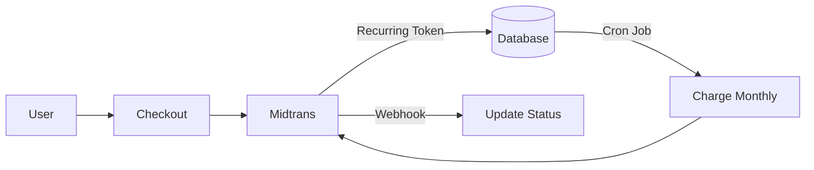
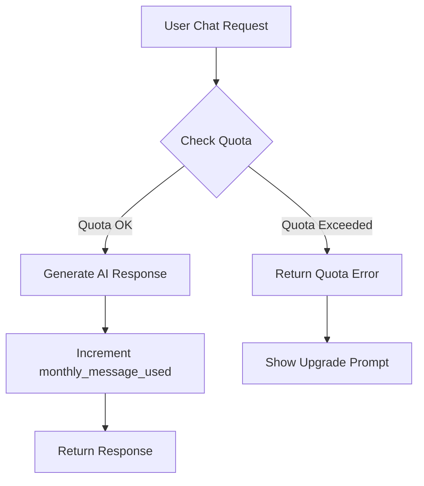

# User Dashboard Features & Subscription Plan
## Chat History, Leads, dan Sistem Berlangganan

---

## Bagian 1: Chat History & Summary di User Panel

### Fitur yang Ditambahkan

| Fitur | Deskripsi |
|-------|-----------|
| **Chat Inbox** | List semua chat session dari widget user |
| **Chat Detail** | Lihat percakapan lengkap per session |
| **Generate Summary** | AI summarize percakapan |
| **Lead Data** | Tampilkan data lead yang dikumpulkan |
| **Export** | Download chat/lead ke CSV |

### Halaman Baru

#### 1. `/user/chats` - Chat Inbox
```
┌──────────────────────────────────────────────────────────┐
│ 💬 Chat History                           [Export CSV]   │
├──────────────────────────────────────────────────────────┤
│ [Filter: All/Has Lead/Pending] [Date Range] [Search]     │
├────────┬──────────┬───────┬─────────┬───────────────────┤
│ Widget │ Customer │ Msgs  │ Status  │ Actions           │
├────────┼──────────┼───────┼─────────┼───────────────────┤
│ Store  │ Budi     │ 12    │ ★ Lead  │ [View] [Summary]  │
│ Store  │ Andi     │ 5     │ Closed  │ [View] [Summary]  │
└────────┴──────────┴───────┴─────────┴───────────────────┘
```

#### 2. `/user/leads` - Lead Collection
```
┌──────────────────────────────────────────────────────────┐
│ 👥 Leads                                  [Export CSV]   │
├──────────────────────────────────────────────────────────┤
│ Total Leads: 156   This Month: 23   Conversion: 4.2%     │
├────────┬──────────┬────────────┬──────────┬─────────────┤
│ Name   │ Email    │ Phone      │ Source   │ Date        │
├────────┼──────────┼────────────┼──────────┼─────────────┤
│ Budi   │ budi@... │ 0812...    │ Widget A │ 15 Jan 2026 │
│ Siti   │ siti@... │ 0813...    │ Widget B │ 14 Jan 2026 │
└────────┴──────────┴────────────┴──────────┴─────────────┘
```

### Database Schema

```sql
-- Chat sessions already exists, add:
ALTER TABLE chat_sessions ADD COLUMN summary TEXT;
ALTER TABLE chat_sessions ADD COLUMN summary_generated_at TIMESTAMP;

-- Lead data stored in chat_sessions with json 'metadata':
-- metadata: { name, email, phone, collected_at }
```

---

## Bagian 2: Halaman Transaksi/Subscription

### Fitur Subscription

| Fitur | Deskripsi |
|-------|-----------|
| **Lihat Plan Aktif** | Status langganan saat ini |
| **Upgrade/Downgrade** | Ganti plan |
| **Billing History** | Riwayat pembayaran |
| **Payment Method** | Kelola metode bayar |
| **Invoice** | Download invoice PDF |

### Halaman `/user/billing`
```
┌──────────────────────────────────────────────────────────┐
│ 💳 Subscription & Billing                                │
├──────────────────────────────────────────────────────────┤
│ ┌─────────────────────────────────────────────────────┐  │
│ │ Your Plan: PRO                    [Change Plan]     │  │
│ │ Next Billing: 15 Feb 2026 - Rp 199.000/bulan        │  │
│ │ Status: Active ✅                                   │  │
│ └─────────────────────────────────────────────────────┘  │
│                                                          │
│ Usage This Month                                         │
│ ████████████████████░░░░░░ 8,234 / 10,000 messages       │
│                                                          │
│ Billing History                                          │
│ ┌───────────┬──────────┬───────────┬─────────┐          │
│ │ Date      │ Amount   │ Status    │ Invoice │          │
│ ├───────────┼──────────┼───────────┼─────────┤          │
│ │ 15 Jan 26 │ Rp199k   │ ✅ Paid   │ [PDF]   │          │
│ │ 15 Dec 25 │ Rp199k   │ ✅ Paid   │ [PDF]   │          │
│ └───────────┴──────────┴───────────┴─────────┘          │
└──────────────────────────────────────────────────────────┘
```

---

## Bagian 3: Sistem Pembayaran Indonesia

### Apakah Midtrans Support Recurring Payment?

**✅ YA!** Midtrans mendukung recurring payment dengan fitur:

| Feature | Support |
|---------|---------|
| **Auto Charge** | ✅ Otomatis charge sesuai interval |
| **Custom Interval** | ✅ Harian, mingguan, bulanan, tahunan |
| **Card Storage** | ✅ Simpan kartu untuk auto-charge |
| **Retry Mechanism** | ✅ Otomatis retry jika gagal |
| **GoPay Recurring** | ✅ Support tokenized GoPay |

### Payment Methods Supported

| Method | Recurring | One-time | Popularity |
|--------|-----------|----------|------------|
| **Credit Card** | ✅ | ✅ | ⭐⭐⭐ |
| **GoPay** | ✅ | ✅ | ⭐⭐⭐⭐⭐ |
| **OVO** | ❌ | ✅ | ⭐⭐⭐⭐ |
| **DANA** | ❌ | ✅ | ⭐⭐⭐⭐ |
| **Bank Transfer** | ❌ | ✅ | ⭐⭐⭐ |
| **QRIS** | ❌ | ✅ | ⭐⭐⭐⭐ |

### Rekomendasi Payment Gateway Indonesia

| Gateway | Recurring | Biaya | Kelebihan |
|---------|-----------|-------|-----------|
| **Midtrans** | ✅ CC & GoPay | 2.9% + Rp2.500 | Terlengkap, docs bagus |
| **Xendit** | ✅ CC & eWallet | 2.9% + Rp2.000 | Fast payout, API modern |
| **DOKU** | ✅ CC | 3% + Rp3.000 | Bank lokal support |
| **Stripe** | ✅ CC | 2.9% + $0.30 | Best for international |

> [!TIP]
> **Rekomendasi:** Gunakan **Midtrans** sebagai primary karena:
> - Support GoPay recurring (paling populer di Indonesia)
> - Dokumentasi lengkap Bahasa Indonesia
> - Laravel package tersedia
> - Local support

---

## Bagian 4: Solusi Berlangganan yang Disarankan

### Opsi 1: Midtrans + Manual Management (Simple)

**Flow:**


**Pros:** Simple, full control
**Cons:** Harus manage billing logic sendiri

### Opsi 2: Laravel Cashier + Stripe (International)

**Pros:** Built-in billing management
**Cons:** Stripe fee + currency conversion

### Opsi 3: Midtrans + Custom Billing System (Recommended)

**Components:**
1. **Subscription Model** - Track plan, status, expiry
2. **Payment Model** - Log semua transaksi
3. **Cron Job** - Auto-charge recurring
4. **Webhooks** - Handle payment status

---

## Bagian 5: Database Schema

```sql
-- Subscriptions table
CREATE TABLE subscriptions (
    id BIGINT PRIMARY KEY AUTO_INCREMENT,
    user_id BIGINT NOT NULL,
    plan_id BIGINT NOT NULL,
    status ENUM('active', 'cancelled', 'expired', 'past_due'),
    payment_method ENUM('credit_card', 'gopay'),
    midtrans_token VARCHAR(255),
    current_period_start DATE,
    current_period_end DATE,
    cancelled_at TIMESTAMP,
    created_at TIMESTAMP,
    updated_at TIMESTAMP
);

-- Payments table
CREATE TABLE payments (
    id BIGINT PRIMARY KEY AUTO_INCREMENT,
    user_id BIGINT NOT NULL,
    subscription_id BIGINT,
    amount DECIMAL(12,2),
    currency VARCHAR(3) DEFAULT 'IDR',
    status ENUM('pending', 'paid', 'failed', 'refunded'),
    payment_method VARCHAR(50),
    midtrans_order_id VARCHAR(100),
    midtrans_transaction_id VARCHAR(100),
    paid_at TIMESTAMP,
    created_at TIMESTAMP
);

-- Invoices table
CREATE TABLE invoices (
    id BIGINT PRIMARY KEY AUTO_INCREMENT,
    user_id BIGINT NOT NULL,
    payment_id BIGINT,
    invoice_number VARCHAR(50),
    amount DECIMAL(12,2),
    pdf_path VARCHAR(255),
    created_at TIMESTAMP
);
```

---

## Implementation Phases

### Phase 1: Chat History & Leads (Week 1)
- [ ] User chat inbox page
- [ ] Chat detail view with summary
- [ ] Lead collection page
- [ ] Export to CSV

### Phase 2: Billing UI (Week 2)
- [ ] Subscription status page
- [ ] Plan comparison & upgrade flow
- [ ] Billing history table
- [ ] Invoice download

### Phase 3: Midtrans Integration (Week 3)
- [ ] Midtrans SDK integration
- [ ] One-time payment checkout
- [ ] Credit card tokenization
- [ ] GoPay recurring setup

### Phase 4: Auto Billing (Week 4)
- [ ] Cron job for auto-charge
- [ ] Payment webhooks
- [ ] Failed payment handling
- [ ] Email notifications

---

## Bagian 6: Tier Membership Restrictions

### Konsep

Admin menentukan plan/tier melalui Plan Manager, dan setiap tier memiliki batasan fitur yang berbeda.

### Plan Features Matrix (Admin Managed)

| Feature | Free | Starter | Pro | Business |
|---------|------|---------|-----|----------|
| **Chatbots** | 1 | 3 | 10 | Unlimited |
| **Messages/month** | 100 | 1,000 | 10,000 | 100,000 |
| **Chat History** | 7 hari | 30 hari | 90 hari | Unlimited |
| **Lead Export** | ❌ | CSV | CSV | CSV + API |
| **AI Quality** | Basic | Standard | Advanced | Premium |
| **WhatsApp** | ❌ | ❌ | ✅ | ✅ |
| **Priority Support** | ❌ | ❌ | ❌ | ✅ |

### Database Schema - Plans Table

```sql
CREATE TABLE plans (
    id BIGINT PRIMARY KEY,
    name VARCHAR(50),              -- "Free", "Starter", "Pro", "Business"
    slug VARCHAR(50),              -- "free", "starter", "pro", "business"
    price DECIMAL(12,2),           -- Monthly price in IDR
    
    -- Limits (Admin configurable)
    max_widgets INT DEFAULT 1,
    max_messages_per_month INT DEFAULT 100,
    max_knowledge_docs INT DEFAULT 5,
    chat_history_days INT DEFAULT 7,
    
    -- Feature flags
    can_export_leads BOOLEAN DEFAULT FALSE,
    can_use_whatsapp BOOLEAN DEFAULT FALSE,
    can_use_wordpress BOOLEAN DEFAULT FALSE,
    has_priority_support BOOLEAN DEFAULT FALSE,
    
    -- AI Settings (Hidden from user)
    ai_tier VARCHAR(20) DEFAULT 'basic',  -- 'basic', 'standard', 'advanced', 'premium'
    
    created_at TIMESTAMP,
    updated_at TIMESTAMP
);
```

### Enforcement Points

```php
// Middleware untuk restrict features
class CheckPlanLimit {
    public function handle($request, $next, $feature) {
        $user = auth()->user();
        $plan = $user->plan;
        
        switch ($feature) {
            case 'widgets':
                if ($user->widgets()->count() >= $plan->max_widgets) {
                    return redirect()->back()->with('error', 'Upgrade plan untuk membuat chatbot baru');
                }
                break;
            case 'messages':
                if ($user->monthly_message_used >= $plan->max_messages_per_month) {
                    return response()->json(['error' => 'Message quota exceeded'], 429);
                }
                break;
        }
        return $next($request);
    }
}
```

---

## Bagian 6.1: Message Quota Enforcement

### Mekanisme Pembatasan Jumlah Chat

| Komponen | Deskripsi |
|----------|-----------|
| **Quota Tracking** | Hitung jumlah pesan AI response per bulan |
| **Real-time Check** | Cek quota sebelum generate AI response |
| **Reset Monthly** | Reset `monthly_message_used` setiap tanggal 1 |
| **Sidebar Display** | Tampilkan usage di sidebar (sudah ada) |

### Sidebar UI (Existing)

```
┌─────────────────────────────────────┐
│ 📊 Penggunaan Bulan Ini             │
├─────────────────────────────────────┤
│ ████████████░░░░░░ 823 / 1,000     │
│                                     │
│ [Upgrade Plan]                      │
└─────────────────────────────────────┘
```

### Flow Diagram



### Apa yang Terjadi Jika Quota Habis?

#### 1. API Response (ChatController)

```php
// Di ChatController sebelum generate AI response
$widget = Widget::where('slug', $widgetId)->with('user.plan')->first();
$user = $widget->user;
$plan = $user->plan;

if ($user->monthly_message_used >= $plan->max_messages_per_month) {
    return response()->json([
        'success' => false,
        'error' => 'quota_exceeded',
        'message' => 'Maaf, kuota pesan bulanan Anda telah habis. Silakan upgrade plan untuk melanjutkan.',
        'quota' => [
            'used' => $user->monthly_message_used,
            'limit' => $plan->max_messages_per_month,
            'reset_date' => now()->startOfMonth()->addMonth()->format('d M Y')
        ]
    ], 429);
}
```

#### 2. Widget Display (User's Website)

```
┌─────────────────────────────────────────┐
│ 🤖 Customer Service                     │
├─────────────────────────────────────────┤
│                                         │
│   ⚠️ Kuota Pesan Habis                  │
│                                         │
│   Chatbot ini telah mencapai batas      │
│   pesan bulanan.                        │
│                                         │
│   Hubungi pemilik website untuk         │
│   informasi lebih lanjut.               │
│                                         │
└─────────────────────────────────────────┘
```

#### 3. User Dashboard Notification

```
┌─────────────────────────────────────────────────────────────┐
│ ⚠️ KUOTA HABIS                                              │
├─────────────────────────────────────────────────────────────┤
│ Kuota pesan bulanan Anda telah habis (1,000/1,000).         │
│ Chatbot Anda tidak akan merespon sampai:                    │
│                                                             │
│ • Kuota direset: 1 Februari 2026, ATAU                      │
│ • Anda upgrade ke plan yang lebih tinggi                    │
│                                                             │
│ [Upgrade Sekarang]                                          │
└─────────────────────────────────────────────────────────────┘
```

### Opsi Handling Quota Habis

| Opsi | Behavior | Pro | Con |
|------|----------|-----|-----|
| **Hard Stop** | Widget berhenti total | Simple, clear limit | Bad UX for visitors |
| **Fallback Message** | Tampilkan pesan statis | Tetap ada info | Tidak interaktif |
| **Grace Period** | 10% extra quota | Smooth transition | Kompleks |
| **Pay-per-use** | Charge per extra msg | Revenue potential | Billing complexity |

> [!TIP]
> **Rekomendasi:** Gunakan **Fallback Message** dengan info kontak alternatif (WhatsApp/Email).

### Quota Reset Mechanism

```php
// Console Command: php artisan quota:reset
// Scheduled: Every 1st of month at 00:00

class ResetMonthlyQuota extends Command {
    protected $signature = 'quota:reset';
    
    public function handle() {
        User::query()->update(['monthly_message_used' => 0]);
        $this->info('Monthly quota reset for all users.');
    }
}

// Di app/Console/Kernel.php
$schedule->command('quota:reset')->monthlyOn(1, '00:00');
```

### Email Notifications

| Trigger | Email Content |
|---------|---------------|
| **80% quota** | "Quota Anda hampir habis (800/1,000)" |
| **100% quota** | "Quota habis! Chatbot berhenti merespon" |
| **Reset** | "Quota bulanan Anda telah direset" |

---

## Bagian 7: Strategi Bisnis - LLM Abstraction

### Pertanyaan: Apakah sebaiknya menyembunyikan model LLM dari user?

**✅ Ya, ini strategi yang valid dan banyak digunakan oleh SaaS AI!**

### Mengapa Menyembunyikan LLM?

| Alasan | Penjelasan |
|--------|------------|
| **Pricing Control** | User fokus bayar "kualitas AI", bukan model spesifik |
| **Flexibility** | Bisa switch model tanpa user aware (cost optimization) |
| **Brand Building** | AI terasa seperti "produk Cekat", bukan "GPT yang di-wrap" |
| **Simplicity** | User tidak perlu paham teknis LLM |
| **Competitive Edge** | Kompetitor tidak tahu model yang dipakai |

### Strategi yang Disarankan: "AI Quality Tiers"

Alih-alih tampilkan nama model (GPT-4, Claude, dll), gunakan **tier abstrak**:

```
┌─────────────────────────────────────────────────────────────┐
│ 🤖 AI Quality                                               │
├─────────────────────────────────────────────────────────────┤
│                                                             │
│ ○ Basic     - Respons cepat, cocok untuk FAQ sederhana      │
│              (Free plan)                                    │
│                                                             │
│ ● Standard  - Respons lebih natural dan kontekstual         │
│              (Starter plan)                 [CURRENT]       │
│                                                             │
│ ○ Advanced  - Pemahaman kompleks, multi-turn superior       │
│              (Pro plan)                                     │
│                                                             │
│ ○ Premium   - AI terbaik, reasoning mendalam                │
│              (Business plan)                                │
│                                                             │
└─────────────────────────────────────────────────────────────┘
```

### Mapping Internal (Hidden from User)

| User-Facing Tier | Actual Models (Admin Dapat Switch) |
|------------------|-----------------------------------|
| **Basic** | Nemotron Free, Llama 3.1 Free |
| **Standard** | GPT-4o Mini, Claude Haiku |
| **Advanced** | GPT-4o, Claude 3.5 Sonnet |
| **Premium** | GPT-4, Claude 3 Opus, Gemini Ultra |

### Implementation

```php
// Di Admin Settings - Map tier ke actual model
$tierModelMapping = [
    'basic' => 'nvidia/nemotron-3-nano-30b-a3b:free',
    'standard' => 'openai/gpt-4o-mini',
    'advanced' => 'openai/gpt-4o',
    'premium' => 'anthropic/claude-3.5-sonnet',
];

// Di ChatController - Get model based on user's plan tier
public function getModelForUser($user) {
    $plan = $user->plan;
    $aiTier = $plan->ai_tier ?? 'basic';
    
    // Admin dapat override mapping di Settings
    $mapping = Setting::get('ai_tier_mapping', $this->defaultMapping);
    
    return $mapping[$aiTier] ?? $mapping['basic'];
}
```

### Perubahan UI yang Diperlukan

1. **Remove** model selection dari user panel
2. **Replace** dengan display "AI Quality: [Tier Name]" yang ditentukan plan
3. **Admin Panel** tetap bisa manage actual model mapping

### Benefits Summary

| Strategi | Benefit |
|----------|---------|
| **Tier-based pricing** | User bayar "value", bukan "model" |
| **Admin flexibility** | Switch model tanpa impact UX |
| **Cost optimization** | Bisa mulai dengan free models, upgrade sesuai kebutuhan |
| **Upsell opportunity** | "Upgrade ke Advanced untuk AI lebih pintar" |

---

## Bagian 8: Admin Plan Manager

### Fitur Admin Panel

| Setting | Deskripsi |
|---------|-----------|
| **Create/Edit Plans** | Buat plan baru atau edit existing |
| **Set Limits** | Tentukan batasan per plan |
| **AI Tier Mapping** | Map AI tier ke actual model |
| **Override User Plan** | Manually upgrade/downgrade user |

### Admin UI Mockup

```
┌──────────────────────────────────────────────────────────┐
│ ⚙️ Plan Manager                           [+ New Plan]   │
├──────────────────────────────────────────────────────────┤
│                                                          │
│ ┌─────────────────────────────────────────────────────┐  │
│ │ FREE PLAN                               [Edit]      │  │
│ │ Price: Rp 0/bulan                                   │  │
│ │ Limits: 1 widget, 100 msgs, AI: Basic               │  │
│ │ Users: 1,234                                        │  │
│ └─────────────────────────────────────────────────────┘  │
│                                                          │
│ ┌─────────────────────────────────────────────────────┐  │
│ │ PRO PLAN                                [Edit]      │  │
│ │ Price: Rp 199.000/bulan                            │  │
│ │ Limits: 10 widgets, 10k msgs, AI: Advanced          │  │
│ │ Users: 89                                           │  │
│ └─────────────────────────────────────────────────────┘  │
│                                                          │
│ AI Tier Mapping (Hidden from Users)                      │
│ ┌─────────────────────────────────────────────────────┐  │
│ │ Basic    → [nvidia/nemotron-free     ▼]            │  │
│ │ Standard → [openai/gpt-4o-mini       ▼]            │  │
│ │ Advanced → [openai/gpt-4o            ▼]            │  │
│ │ Premium  → [anthropic/claude-3.5     ▼]            │  │
│ └─────────────────────────────────────────────────────┘  │
└──────────────────────────────────────────────────────────┘
```

---

## Next Steps

1. [ ] Review plan ini
2. [ ] Approve business strategy (LLM abstraction)
3. [ ] Approve database schema
4. [ ] Pilih payment gateway (Midtrans recommended)
5. [ ] Daftar Midtrans merchant account
6. [ ] Mulai Phase 1: Chat History & Leads

