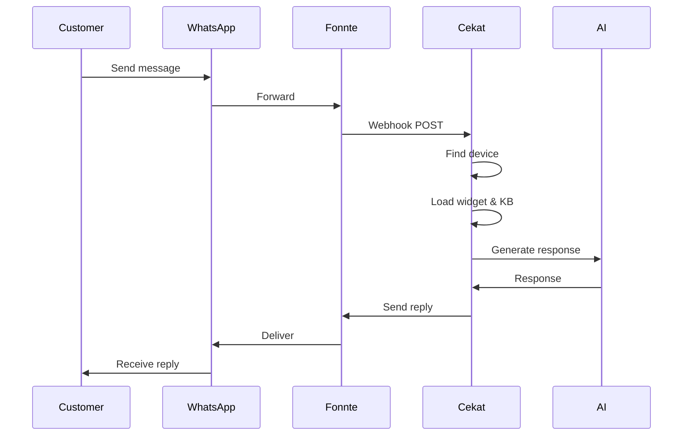

# WhatsApp Integration Implementation

## Overview

Implemented a modular WhatsApp integration using Fonnte as the provider. The module is designed to be:
- **Toggleable** - Admin can enable/disable via Settings
- **Modular** - Separated into its own services, controllers, and views
- **Multi-tenant** - Each user can have their own WhatsApp devices linked to their widgets

## Architecture

```
┌─────────────────────────────────────────────────────────────────┐
│                        ADMIN DASHBOARD                          │
│  ┌──────────────────────────────────────────────────────────┐  │
│  │ WhatsApp Settings                                        │  │
│  │ - Module Toggle (Enable/Disable)                         │  │
│  │ - Fonnte Account Token                                   │  │
│  │ - Device Monitor                                         │  │
│  └──────────────────────────────────────────────────────────┘  │
└─────────────────────────────────────────────────────────────────┘

┌─────────────────────────────────────────────────────────────────┐
│                        USER DASHBOARD                           │
│  ┌──────────────────────────────────────────────────────────┐  │
│  │ WhatsApp Devices                                         │  │
│  │ - Create Device                                          │  │
│  │ - Scan QR Code                                           │  │
│  │ - View Messages                                          │  │
│  │ - Link to Widget                                         │  │
│  └──────────────────────────────────────────────────────────┘  │
└─────────────────────────────────────────────────────────────────┘

┌─────────────────────────────────────────────────────────────────┐
│                         FONNTE                                  │
│  ┌──────────────────────────────────────────────────────────┐  │
│  │ Account Token → Manage all devices                       │  │
│  │ Device Token → Send/receive messages per device          │  │
│  │ Webhook → Receive incoming messages                      │  │
│  └──────────────────────────────────────────────────────────┘  │
└─────────────────────────────────────────────────────────────────┘
```

## Files Created

### Migrations
- `database/migrations/2026_01_18_000001_create_whatsapp_devices_table.php`
- `database/migrations/2026_01_18_000002_create_whatsapp_messages_table.php`

### Models
- `app/Models/WhatsAppDevice.php`
- `app/Models/WhatsAppMessage.php`

### Services
- `app/Services/WhatsApp/FonnteService.php` - Low-level Fonnte API wrapper
- `app/Services/WhatsApp/WhatsAppManager.php` - High-level business logic

### Controllers
- `app/Http/Controllers/WhatsAppController.php` - User-facing device management
- `app/Http/Controllers/Api/WhatsAppWebhookController.php` - Webhook handler

### Livewire Components
- `app/Livewire/Admin/WhatsAppSettings.php` - Admin settings page

### Views
- `resources/views/whatsapp/index.blade.php` - Device list
- `resources/views/whatsapp/connect.blade.php` - QR code scan
- `resources/views/whatsapp/messages.blade.php` - Message history
- `resources/views/whatsapp/disabled.blade.php` - Module disabled page
- `resources/views/livewire/admin/whatsapp-settings.blade.php` - Admin settings

### Seeders
- `database/seeders/WhatsAppSettingsSeeder.php`

## Database Schema

### whatsapp_devices
| Column | Type | Description |
|--------|------|-------------|
| id | bigint | Primary key |
| user_id | bigint | Owner user |
| widget_id | bigint | Linked widget (nullable) |
| fonnte_device_id | string | Fonnte device ID |
| fonnte_device_token | string | Fonnte device token |
| phone_number | string | Connected WhatsApp number |
| device_name | string | Display name |
| status | enum | pending/connecting/connected/disconnected/expired |
| plan | enum | Fonnte plan tier |
| messages_sent | int | Counter |
| messages_received | int | Counter |
| is_active | boolean | Active flag |
| settings | json | Device-specific settings |

### whatsapp_messages
| Column | Type | Description |
|--------|------|-------------|
| id | bigint | Primary key |
| whatsapp_device_id | bigint | Parent device |
| widget_id | bigint | Widget used for AI |
| sender_phone | string | Phone number |
| sender_name | string | Push name |
| direction | enum | inbound/outbound |
| message | text | Message content |
| message_type | enum | text/image/audio/video/document/location/contact |
| status | enum | pending/sent/delivered/read/failed |
| is_ai_response | boolean | AI generated flag |
| tokens_used | int | AI tokens used |

## Routes

### User Routes (`/whatsapp/*`)
| Method | Path | Description |
|--------|------|-------------|
| GET | /whatsapp | Device list |
| POST | /whatsapp/create | Create new device |
| GET | /whatsapp/{device}/connect | QR code page |
| GET | /whatsapp/{device}/qr | Get QR code (AJAX) |
| GET | /whatsapp/{device}/status | Refresh status (AJAX) |
| PUT | /whatsapp/{device} | Update device |
| POST | /whatsapp/{device}/disconnect | Disconnect |
| DELETE | /whatsapp/{device} | Delete device |
| GET | /whatsapp/{device}/messages | Message history |

### Admin Routes
| Method | Path | Description |
|--------|------|-------------|
| GET | /admin/whatsapp | WhatsApp settings page |

### API Routes (No Auth)
| Method | Path | Description |
|--------|------|-------------|
| POST | /api/whatsapp/webhook/{device_id} | Fonnte webhook |

## Settings (Stored in `settings` table)

| Key | Type | Default | Description |
|-----|------|---------|-------------|
| whatsapp_module_enabled | boolean | false | Master toggle |
| fonnte_account_token | string | "" | Fonnte Account Token |
| whatsapp_fallback_message | string | "Maaf..." | Fallback message |
| whatsapp_auto_reply_enabled | boolean | true | Enable AI auto-reply |
| whatsapp_max_devices_per_user | number | 1 | Max devices per user |

## How to Use

### 1. Admin Setup
1. Go to Admin → WhatsApp Settings
2. Get your Fonnte Account Token from [md.fonnte.com](https://md.fonnte.com) → Settings
3. Enter the Account Token
4. Click "Test Connection" to verify
5. Toggle "Enable" to activate the module
6. Configure other settings as needed

### 2. User Setup
1. Go to Dashboard → WhatsApp
2. Click "Connect WhatsApp"
3. Enter device name
4. Select widget to link (optional)
5. Scan QR code with WhatsApp
6. Done! AI will now reply to messages

## Flow: Incoming Message



## Security Considerations

1. **Webhook Validation** - Device ID must exist and be active
2. **User Authorization** - Users can only manage their own devices
3. **Rate Limiting** - Consider adding rate limits for webhooks
4. **Token Security** - Fonnte tokens are stored securely in settings

## Warning: Unofficial API

> ⚠️ **IMPORTANT**: Fonnte uses an unofficial WhatsApp API. There is a risk of accounts being banned.
> - Recommend using dedicated phone numbers
> - Clearly communicate risk to users
> - Consider official API alternatives for production

## Future Improvements

- [ ] Add media message support (images, documents)
- [ ] Implement conversation threading by phone number
- [ ] Add analytics dashboard for WhatsApp stats
- [ ] Support group message handling
- [ ] Add message templates
- [ ] Implement official WhatsApp Cloud API option
- [ ] Add plan-based device limits
