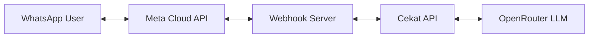

# WhatsApp Integration Plan
## Cekat AI Chatbot × WhatsApp

---

## Jawaban Pertanyaan Anda

### 1. Apakah integrasi WhatsApp memungkinkan?

**✅ Ya, sangat memungkinkan!** Ada 2 cara utama:

| Metode | Deskripsi | Cocok Untuk |
|--------|-----------|-------------|
| **WhatsApp Cloud API** | API resmi dari Meta, hosted di cloud Meta | Business yang butuh reliability & compliance |
| **Third-Party BSP** | Provider seperti Twilio, WATI, Fonnte | Business yang butuh fitur tambahan & support lokal |

### 2. API Resmi WhatsApp - Pricing & Requirements

#### a) Pricing (Updated 2025/2026)

> [!IMPORTANT]
> **Perubahan besar Juli 2025:** Conversation-based pricing **deprecated**, diganti dengan **per-message pricing**.

**Model Pricing Baru (Per-Message):**

| Message Type | Contoh | Estimasi Biaya |
|--------------|--------|----------------|
| **Service/Inbound** | Balasan customer | FREE (user-initiated) |
| **Marketing** | Promo, diskon | ~$0.02-0.05/msg |
| **Utility** | Order confirmation, shipping | ~$0.01-0.02/msg |
| **Authentication** | OTP, verifikasi | ~$0.01-0.02/msg |

**Free Tier:**
- 1,000 conversations/bulan GRATIS
- Click-to-WhatsApp ads: FREE untuk 72 jam

**BSP Fees (jika lewat provider):**
- Setup: $0 - $1,000 (one-time)
- Monthly: $50 - $500/bulan
- Per-message markup: varies

#### b) Requirements untuk WhatsApp Cloud API

| Requirement | Detail |
|-------------|--------|
| **Meta Business Manager** | Akun Facebook Business verified |
| **Business Verification** | Dokumen legal: SIUP/NIB, NPWP, KTP owner |
| **Website HTTPS** | Website aktif dengan SSL |
| **Phone Number** | Nomor dedicated (tidak terdaftar WA lain) |
| **Display Name Approval** | Nama bisnis disetujui Meta |
| **Message Templates** | Template pesan harus diapprove Meta |
| **Credit Card** | Untuk billing |

---

## Mekanisme Integrasi

### Architecture


### Alur Pesan Masuk:
1. User kirim pesan ke nomor WhatsApp bisnis
2. Meta Cloud API mengirim webhook ke server Cekat
3. Server Cekat memproses pesan dengan AI
4. Response dikirim balik via Cloud API
5. User menerima balasan di WhatsApp

---

## Opsi Implementasi

### Option A: Direct Cloud API (Recommended)

**Pros:**
- Biaya paling rendah (hanya Meta fees)
- Full control
- No middleman

**Cons:**
- Perlu develop sendiri
- Handle compliance sendiri

**Tech Stack:**
```php
// Laravel integration example
use Illuminate\Support\Facades\Http;

class WhatsAppController {
    public function webhook(Request $request) {
        $message = $request->input('entry.0.changes.0.value.messages.0');
        
        // Process with Cekat AI
        $response = CekatAI::chat($message['text']['body'], $message['from']);
        
        // Send reply
        $this->sendMessage($message['from'], $response);
    }
    
    private function sendMessage($to, $text) {
        Http::withToken(config('services.whatsapp.token'))
            ->post('https://graph.facebook.com/v24.0/PHONE_ID/messages', [
                'messaging_product' => 'whatsapp',
                'to' => $to,
                'text' => ['body' => $text]
            ]);
    }
}
```

### Option B: Via BSP (Easier Setup)

**Recommended Providers Indonesia:**
| Provider | Pricing | Features |
|----------|---------|----------|
| **WATI.io** | $49/mo + | Dashboard, templates, analytics |
| **Fonnte.com** | Rp 100k/mo + | Indonesia-based, local support |
| **Twilio** | Pay-as-you-go | Developer-friendly, global |
| **360Dialog** | €0/mo + usage | Direct Meta partner |

---

## Fitur yang Dapat Diintegrasikan

### Phase 1: Basic
- [ ] Receive/reply messages
- [ ] AI-powered responses
- [ ] Knowledge base context

### Phase 2: Enhanced
- [ ] Template messages (marketing, utility)
- [ ] Media messages (images, documents)
- [ ] Quick reply buttons
- [ ] List messages

### Phase 3: Advanced
- [ ] WooCommerce order status via WA
- [ ] Appointment booking
- [ ] Payment links
- [ ] Human handoff workflow
- [ ] Multi-agent support

---

## Estimasi Biaya Bulanan

| Skenario | Messages | Meta Cost | BSP Cost | Total |
|----------|----------|-----------|----------|-------|
| **Starter** | 1,000 | FREE | $0 | FREE |
| **Small Biz** | 5,000 | ~$80 | ~$50 | ~$130 |
| **Medium** | 20,000 | ~$350 | ~$100 | ~$450 |
| **Enterprise** | 100,000+ | ~$1,500 | ~$300 | ~$1,800 |

---

## Langkah Mendapatkan API Access

1. **Buat Meta Business Manager** di business.facebook.com
2. **Verifikasi bisnis** dengan dokumen legal
3. **Daftar WhatsApp Cloud API** di Meta Developer Console
4. **Tambah nomor telepon** & verifikasi
5. **Setup webhook** untuk terima pesan
6. **Buat message templates** & submit untuk approval
7. **Integrate dengan Cekat** AI backend

---

## Rekomendasi

> [!TIP]
> Untuk **MVP/testing**, gunakan **WhatsApp Cloud API langsung** karena:
> - 1,000 msg/bulan FREE
> - Tidak perlu bayar BSP
> - Full control

> [!NOTE]
> Untuk **production scale**, pertimbangkan BSP seperti **Fonnte** (Indonesia) atau **WATI** untuk:
> - Dashboard management
> - Template approval lebih mudah
> - Local support

---

## Next Steps

1. [ ] Review plan ini
2. [ ] Pilih metode: Direct API atau BSP
3. [ ] Setup Meta Business Manager & verifikasi
4. [ ] Develop webhook endpoint di Cekat
5. [ ] Testing dengan sandbox number
6. [ ] Go live dengan production number
