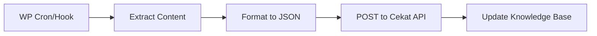

# WordPress Plugin Implementation Plan
## Cekat AI Chatbot for WordPress

---

## Executive Summary

Plugin WordPress yang tidak hanya menampilkan widget chatbot, tapi juga berfungsi sebagai **agent training otomatis** yang mengambil data dari WordPress (pages, posts, products) dan menyinkronkan ke Knowledge Base di server Cekat.biz.id.

---

## Core Features

### 1. Auto-Training Agent (Content Scraper)

**Fungsi:** Plugin secara otomatis mengekstrak konten website dan mengirim ke API Cekat untuk dijadikan knowledge base.

| Data Source | Content Extracted |
|-------------|-------------------|
| **Posts** | Title, content, excerpt, categories, tags |
| **Pages** | Title, content, meta descriptions |
| **Custom Post Types** | Semua CPT yang public |
| **Menus** | Navigation structure |
| **Site Info** | Site name, tagline, contact info |

**Workflow:**


**Hooks yang digunakan:**
- `save_post` - Sync saat post disimpan
- `delete_post` - Remove dari KB saat dihapus
- `wp_cron` - Full sync terjadwal (daily)

---

### 2. WooCommerce Integration

**Ya, sangat memungkinkan!** Plugin dapat mengakses semua data WooCommerce melalui WC API.

#### Data yang dapat diambil:

| Category | Data Available | Chatbot Use Case |
|----------|---------------|------------------|
| **Products** | Name, price, SKU, description, stock, images, categories | "Berapa harga produk X?", "Produk apa yang tersedia?" |
| **Stock** | In stock, out of stock, backorder status | "Apakah produk Y masih ada stok?" |
| **Orders** | Order status, tracking, items | "Cek status pesanan #12345" |
| **Shipping** | Methods, rates, zones | "Berapa ongkir ke Jakarta?" |
| **Coupons** | Active codes, discounts | "Ada promo apa hari ini?" |
| **Categories** | Product taxonomy | "Tampilkan produk kategori Elektronik" |

#### Order Tracking Feature:
```
User: "Cek pesanan saya nomor 12345"
Bot: Mengecek... Pesanan #12345
     Status: Dalam Pengiriman
     Kurir: JNE (AWB: JNE123456789)
     Estimasi: 2-3 hari kerja
```

---

### 3. Recommended Plugin Features

#### A. Core Features (MVP)
- [ ] Widget embed (existing)
- [ ] API key authentication
- [ ] Widget customization in WP Admin
- [ ] Content sync to Cekat API
- [ ] Basic analytics display

#### B. Content Training
- [ ] Auto-sync posts/pages on save
- [ ] Manual "Sync All Content" button
- [ ] Select which post types to sync
- [ ] Exclude specific pages/categories
- [ ] Sync status indicator

#### C. WooCommerce Features
- [ ] Product catalog sync
- [ ] Real-time stock info
- [ ] Order status lookup (by email or order ID)
- [ ] Add to cart via chat
- [ ] Product recommendations
- [ ] Abandoned cart reminders

#### D. Advanced Features
- [ ] Multi-language support (WPML/Polylang)
- [ ] Role-based responses
- [ ] Business hours aware
- [ ] Human handoff to WhatsApp/Email
- [ ] Lead capture to WP Users
- [ ] Custom intents/commands

#### E. Admin Dashboard
- [ ] Chat history view
- [ ] FAQ management (sync to KB)
- [ ] Training suggestions
- [ ] Usage statistics
- [ ] Response quality feedback

---

## Technical Architecture

### Plugin Structure
```
cekat-ai-chatbot/
├── cekat-ai-chatbot.php          # Main plugin file
├── includes/
│   ├── class-admin.php           # Admin settings page
│   ├── class-api.php             # API communication
│   ├── class-content-sync.php    # Content extraction
│   ├── class-woocommerce.php     # WC integration
│   └── class-widget.php          # Widget rendering
├── assets/
│   ├── css/admin.css
│   └── js/admin.js
└── templates/
    └── settings-page.php
```

### API Endpoints Required (Cekat Server)

| Endpoint | Method | Description |
|----------|--------|-------------|
| `/api/plugin/sync-content` | POST | Sync page/post content |
| `/api/plugin/sync-products` | POST | Sync WooCommerce products |
| `/api/plugin/check-order` | GET | Check order status |
| `/api/plugin/widget-config` | GET | Get widget settings |

---

## Implementation Phases

### Phase 1: Basic Plugin (Week 1)
- Plugin setup & activation
- Settings page with API key
- Widget embed in footer
- Manual widget ID configuration

### Phase 2: Content Sync (Week 2)
- Posts/Pages extraction
- Auto-sync on save_post hook
- Manual sync button
- Sync status & logs

### Phase 3: WooCommerce (Week 3)
- Product sync to KB
- Stock availability queries
- Order status lookup via chat
- Real-time product search

### Phase 4: Advanced (Week 4+)
- Add to cart functionality
- Multi-language
- Analytics dashboard
- Human handoff integration

---

## Security Considerations

> [!IMPORTANT]
> - API key stored encrypted in wp_options
> - Order lookup requires email verification
> - Rate limiting on API calls
> - Nonce verification on all AJAX
> - Capability checks for admin pages

---

## Pricing Tier Features

| Feature | Free | Pro | Business |
|---------|------|-----|----------|
| Widget Embed | ✅ | ✅ | ✅ |
| Content Sync | 10 pages | Unlimited | Unlimited |
| WooCommerce | ❌ | ✅ | ✅ |
| Order Lookup | ❌ | ✅ | ✅ |
| Analytics | Basic | Advanced | Full |
| Human Handoff | ❌ | ❌ | ✅ |

---

## Next Steps

1. **Review plan** - Confirm features & priorities
2. **Create API endpoints** - Backend support for plugin
3. **Develop MVP plugin** - Basic embed + settings
4. **Add content sync** - Auto-training feature
5. **WooCommerce integration** - Product & order features
6. **Testing & submission** - WordPress.org or private distribution
